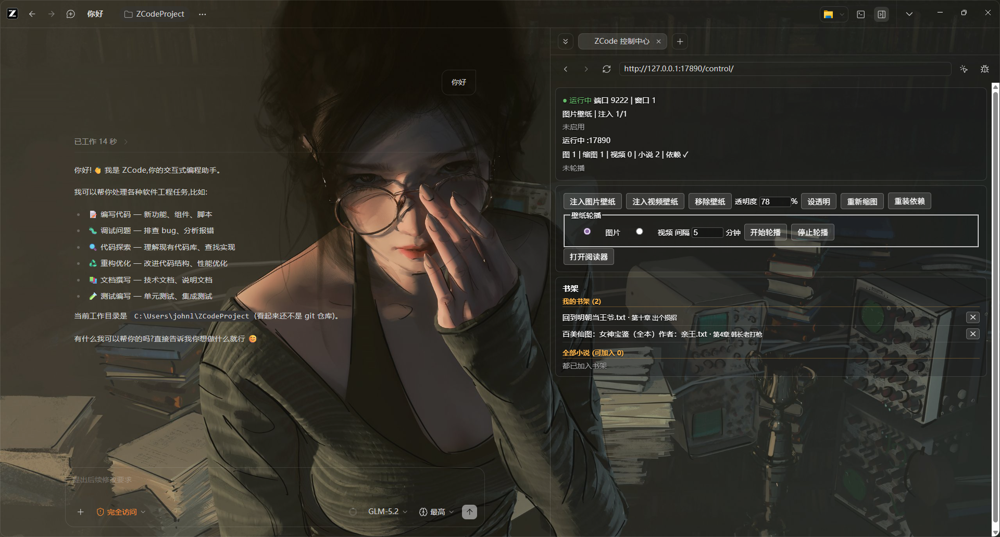

# ZCode 壁纸 (zcode-wallpaper)

给 ZCode 桌面客户端加自定义壁纸，**不修改 app.asar**，ZCode 升级后不会被覆盖。

## 效果预览



## 功能

- **一键启动带壁纸的 ZCode**：双击 `start-zcode.bat`，自动带调试端口启动 ZCode 并注入壁纸。
- **随机轮播**：每次启动从你的壁纸库里随机选一张，同一次会话内固定。
- **批量缩图**：相机原图（几十 MB）会自动缩到可渲染的大小，增量处理、重复跑很快。
- **可调透明度 / 毛玻璃**：改 `wallpaper.css` 一个数字即可。
- **一键移除**：双击 `remove-wallpaper.bat` 立即恢复默认外观。
- **跨电脑可用**：不包含任何本机专属信息，clone 到任意 Windows 电脑按下方流程跑一遍即可。

## 前置要求

- **Node.js v18+**：https://nodejs.org 下 LTS 版安装。没装的话 `setup.bat` 会提示，不会报一堆错。
- **ZCode 客户端**已安装。

## 1. 安装

```bash
git clone <你的仓库地址> zcode-wallpaper
cd zcode-wallpaper
```

## 2. 初始化（每台新电脑做一次）

双击 **`setup.bat`**。它会自动完成：

- 检查 Node.js 版本（≥18）
- 探测 ZCode.exe 位置
- 创建 `wallpapers/` 目录（放你自己的图）
- 安装依赖（`npm install`）

看到 `初始化完成！` 即可。

## 3. 放图片

把你的壁纸原图复制进 **`wallpapers/`** 目录（项目根目录下，已被 `.gitignore` 忽略，私人照片不会提交）。

> ⚠️ 文件名请用**纯英文、别用中文/空格**（`file://` 加载中文路径可能失败）。支持 `.jpg .jpeg .png .webp`。

## 4. 压缩图片

相机原图（30-39MB）体积过大，Electron 的 `background-image` 加载会静默失败。必须先缩图：

双击 **`resize.bat`**。它会：

- 扫描 `wallpapers/` 的栅格图
- 缩到长边 ≤2560px、JPEG 质量 85
- 输出到 `wallpapers-thumb/`（inject 实际读的是这里）
- **增量**：已缩过且不比源旧的自动跳过

看到"缩图完成"即可。

> 💡 以后每加一张新图：放进 `wallpapers/` → 双击 `resize.bat`。

## 5. 启动

> ⚠️ **必须先完全退出 ZCode**（所有窗口 + 右下角托盘图标）。ZCode 是单实例应用，有残留进程时带调试端口的新实例会启动失败。

双击 **`start-zcode.bat`**。它会自动完成全部步骤：

1. 探测并杀掉残留的 ZCode 进程
2. 带 `--remote-debugging-port=9222` 启动 ZCode
3. 等待主窗口就绪
4. 注入壁纸（带重试验证，冷启动慢也能兜住）

看到 `Done! Wallpaper applied.` 即成功。以后每次开机用 ZCode，双击这一个 bat 即可。

## 6. 移除壁纸

双击 **`remove-wallpaper.bat`**，当前会话立即恢复默认外观。

## 进阶：调透明度 / 毛玻璃

打开 `wallpaper.css`，按注释调：

- **`[透明度]`**：`rgba(..., 0.82)` 最后一位（0~1），越小壁纸越显、字越淡
- **`[模糊]`**：取消第 4 段注释，设 `blur(8px)`

改完双击 `inject-only.bat` 即时生效（无需重启 ZCode）。

## 文件说明

| 文件 | 作用 |
|------|------|
| `setup.bat` | 初始化：检查环境 + 准备目录 + 装依赖 |
| `resize.bat` | 把 `wallpapers/` 原图批量缩到 `wallpapers-thumb/` |
| `start-zcode.bat` | 启动带壁纸的 ZCode（一键完成启动+注入） |
| `inject-only.bat` | 单独注入壁纸（改完 CSS 后用，无需重启） |
| `remove-wallpaper.bat` | 移除壁纸 |
| `wallpaper.css` | 壁纸样式（透明度/模糊在这调） |
| `wallpapers/` | **放你的原图**（`.gitignore` 已忽略） |
| `wallpapers-thumb/` | 缩图产物（inject 实际读这里，`.gitignore` 已忽略） |

## 故障排查

| 现象 | 处理 |
|------|------|
| 看不到壁纸 | 确认：① 已跑过 `resize.bat`（`wallpapers-thumb/` 非空）② 是用 `start-zcode.bat` 启动的（不是直接开 ZCode）③ 启动前已完全退出旧 ZCode |
| `找不到 ZCode.exe` | 自动探测失败，手动编辑 `start-zcode.bat` 里的 `ZCODE_EXE` |
| 壁纸太花看不清字 | 调高 `wallpaper.css` 里的 alpha，或开毛玻璃模糊 |
| ZCode 升级后壁纸没了 | 正常，升级会换 app.asar 但不影响本工具。重跑 `start-zcode.bat` 即可 |

## 安全说明

- 调试端口 9222 仅监听本机回环（127.0.0.1），不对外网开放；
- 注入的是纯 CSS，不读写文件、不上传数据；
- 不修改、不替换 ZCode 的任何程序文件。

## License

MIT — 见 [LICENSE](LICENSE)。
